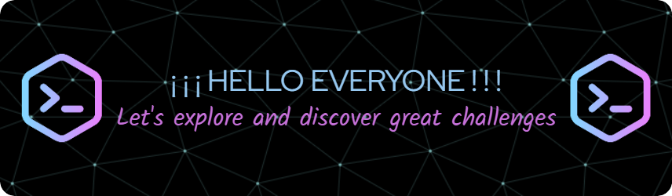

<!-- 1) STICKER + TÍTULO -->
# THE PATH OF THE NINJA PROGRAMMER

<!-- 2) BANNER -->

<!-- 3) CONTENIDO BREVE -->
### The path of the programmer ninja will be full of adventures and continuous learning, each line of code is a step towards knowledge and each bug overcome, a lesson learned.

### Together as a true ninja team, we will face the great challenges with discipline, creativity and perseverance to achieve our dreams.

### ¡¡ Dattebayo !!

<!--
**Jitap/Jitap** is a ✨ _special_ ✨ repository because its `README.md` (this file) appears on your GitHub profile.

Here are some ideas to get you started:

- 🔭 I’m currently working on ...
- 🌱 I’m currently learning ...
- 👯 I’m looking to collaborate on ...
- 🤔 I’m looking for help with ...
- 💬 Ask me about ...
- 📫 How to reach me: ...
- 😄 Pronouns: ...
- ⚡ Fun fact: ...
-->
