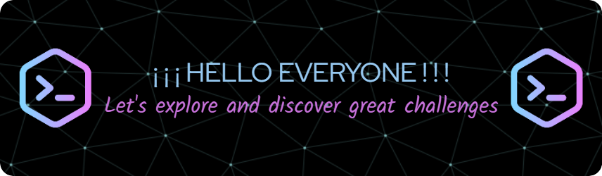

<!-- 1) TÍTULO -->
<h1 align="center" style="color: cyan;"> WELCOME TO MY GITHUB . . . 
</h1>

<!-- 2) BANNER -->

<!-- 3) CONTENIDO BREVE -->
### Greetings to you from JIMMY, a programmer analyst dedicated to software development and maintenance.

### My goal is to apply my skills and knowledge for problem solving and thus improve the efficiency and effectiveness of software development.

### Currently, I am looking for new opportunities to collaborate with dynamic teams and contribute to challenging projects.

### Together as a true team, we will face the great challenges with discipline, creativity and perseverance to achieve our dreams.

<h3 align = "right"> ¡ Thank you for your visit ! </h3>

<!--
**Jitap/Jitap** is a ✨ _special_ ✨ repository because its `README.md` (this file) appears on your GitHub profile.

Here are some ideas to get you started:

- 🔭 I’m currently working on ...
- 🌱 I’m currently learning ...
- 👯 I’m looking to collaborate on ...
- 🤔 I’m looking for help with ...
- 💬 Ask me about ...
- 📫 How to reach me: ...
- 😄 Pronouns: ...
- ⚡ Fun fact: ...
-->
